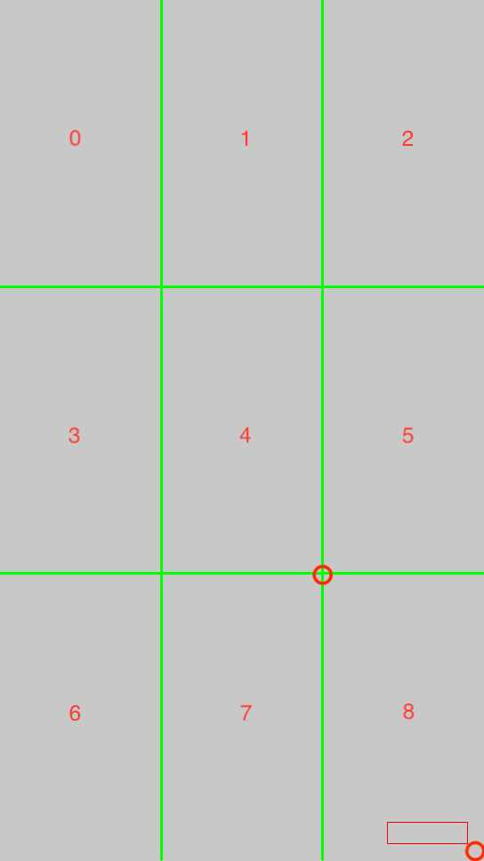

# 水印位置动态计算

### 水印动态计算算法
根据输入的视频长、宽、水印图像的长、宽和缩放比例进行动态水印图像大小及位置计算。计算原理为首先把图像分割为九宫格，把水印放到最后一个宫格中，根据宫格大小、宫格坐标进行对水印位置和大小的计算。示例图：


### MediaConvert 水印添加自动化最佳方式
经过实验，把水印图像根据需要输出的的分辨率进行提前缩放，然后配置到MediaConvert的output中会有比较好的效果，同时建议透明度`Opacity`设置为`100`,详情查看`template.json`。此项目把整个流程做了自动化处理：
1. 根据输入的视频源和需要输出视频的分辨宽（360/480），计算得到输出视频的高度。
2. 根据输出视频的宽度和高度自动计算九宫格
3. 根据需要放置的宫格、源水印宽、缩放比例、边距计算输出水印放置的坐标和宽高
4. 根据源水印、输出水印宽用`ffmpeg`缩放输出水印，并上传到S3
5. 修改转码模版中输出水印对于坐标和水印地址
6. 根据转码模版进行转码

## 目录

- [水印位置动态计算](#水印位置动态计算)
    - [水印动态计算算法](#水印动态计算算法)
    - [MediaConvert 水印添加自动化最佳方式](#mediaconvert-水印添加自动化最佳方式)
  - [目录](#目录)
          - [配置要求](#配置要求)
          - [安装步骤](#安装步骤)
    - [文件目录说明](#文件目录说明)
    - [效果](#效果)
    - [使用到的框架](#使用到的框架)
    - [版本控制](#版本控制)
    - [作者](#作者)

###### 配置要求

1. Lambda Python 3.9.0
2. OpenCV Python 3.9(可选，为模拟效果使用)
3. ffmpeg

###### 安装步骤
```sh
git clone https://github.com/hillday/water-marker-lambda.git
```

### 文件目录说明

```
aws_emr_presto_custom_autoscalling 
├── README.md
├── /images/
├── lambda_function.py # lambda 函数
├── template.json # 转码模版
├── cv2-python37.zip # lambda opencv 依赖层
├── cv2-python37.zip # lambda ffmpeg 依赖层
```
把函数代码复制到aws lambda 函数中，然后添加层。

### 效果
水印宽为`320`,高为`88`。红色框表示水印大小、位置。
1. 当输入视频宽为`960`,高为`720`时
   
2. 当输入视频宽为`960`,高为`544`时
   
3. 当输入视频宽为`544`,高为`968`时<br/>
   


### 使用到的框架

- [opencv-python](https://pypi.org/project/opencv-python/)
- [ffmpeg](https://ffmpeg.org/)
### 版本控制

该项目使用Git进行版本管理。您可以在repository参看当前可用版本。

### 作者

qchunhai

